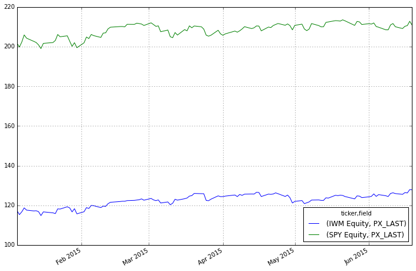

Title: Intro to pdblp
Date: 2015-06-21
Slug: pdblp
Summary: This is a simple introduction to pdblp, a wrapper for easy Bloomberg and pandas integration

This is a simple introduction to pdblp, a wrapper for easy Bloomberg and pandas integration


```python
%pylab inline
import pdblp
```

    Populating the interactive namespace from numpy and matplotlib


The project [pdblp](https://github.com/MatthewGilbert/pdblp) borrows heavily from the package by kyuni22, which is available [here](https://github.com/kyuni22/pybbg).

The package currently wraps the Historical Data Request service and the Intraday Bar Request service. More details of the Open API can be found [here](http://www.bloomberglabs.com/api/documentation/)

Before running this notebook you need to have access to a Bloomberg terminal on a windows machine and download and install pdblp

```
git clone https://github.com/MatthewGilbert/pdblp.git
cd pdblp
pip install -e pdblp
```


```python
con = pdblp.BCon(debug=False)
con.start()
```


```python
print(con.bdh.__doc__)
```

    
            Get tickers and fields, return pandas dataframe with column MultiIndex
            of tickers and fields
    
            Parameters
            ----------
            tickers: {list, string}
                String or list of strings corresponding to tickers
            flds: {list, string}
                String or list of strings corresponding to FLDS
            start_date: string
                String in format YYYYmmdd
            end_date: string
                String in format YYYYmmdd
            


```python
df = con.bdh(['SPY Equity', 'IWM Equity'], 'PX_LAST', '20150103', '20150619')
```


```python
df.head()
```


<div style="max-height:1000px;max-width:1500px;overflow:auto;">
<table border="1" class="dataframe">
  <thead>
    <tr>
      <th>ticker</th>
      <th>IWM Equity</th>
      <th>SPY Equity</th>
    </tr>
    <tr>
      <th>field</th>
      <th>PX_LAST</th>
      <th>PX_LAST</th>
    </tr>
  </thead>
  <tbody>
    <tr>
      <th>2015-01-05</th>
      <td> 117.34</td>
      <td> 201.72</td>
    </tr>
    <tr>
      <th>2015-01-06</th>
      <td> 115.31</td>
      <td> 199.82</td>
    </tr>
    <tr>
      <th>2015-01-07</th>
      <td> 116.73</td>
      <td> 202.31</td>
    </tr>
    <tr>
      <th>2015-01-08</th>
      <td> 118.71</td>
      <td> 205.90</td>
    </tr>
    <tr>
      <th>2015-01-09</th>
      <td> 117.57</td>
      <td> 204.25</td>
    </tr>
  </tbody>
</table>
</div>


```python
df.plot(figsize=(12,8))
```


    <matplotlib.axes._subplots.AxesSubplot at 0xb62a828>





The bdh() function call returns a MultiIndex by default to be a consistent type in case multiple fields are requested


```python
df2 = con.bdh(['SPY Equity', 'IWM Equity'], ['PX_LAST', 'VOLUME'], '20150103', '20150619')
```


```python
df2.head()
```


<div style="max-height:1000px;max-width:1500px;overflow:auto;">
<table border="1" class="dataframe">
  <thead>
    <tr>
      <th>ticker</th>
      <th colspan="2" halign="left">IWM Equity</th>
      <th colspan="2" halign="left">SPY Equity</th>
    </tr>
    <tr>
      <th>field</th>
      <th>PX_LAST</th>
      <th>VOLUME</th>
      <th>PX_LAST</th>
      <th>VOLUME</th>
    </tr>
  </thead>
  <tbody>
    <tr>
      <th>2015-01-05</th>
      <td> 117.34</td>
      <td> 51141891</td>
      <td> 201.72</td>
      <td> 169632646</td>
    </tr>
    <tr>
      <th>2015-01-06</th>
      <td> 115.31</td>
      <td> 67446040</td>
      <td> 199.82</td>
      <td> 209151408</td>
    </tr>
    <tr>
      <th>2015-01-07</th>
      <td> 116.73</td>
      <td> 32252095</td>
      <td> 202.31</td>
      <td> 125346709</td>
    </tr>
    <tr>
      <th>2015-01-08</th>
      <td> 118.71</td>
      <td> 28361730</td>
      <td> 205.90</td>
      <td> 147217784</td>
    </tr>
    <tr>
      <th>2015-01-09</th>
      <td> 117.57</td>
      <td> 26975175</td>
      <td> 204.25</td>
      <td> 158567288</td>
    </tr>
  </tbody>
</table>
</div>


```python
print(con.bdib.__doc__)
```

    
            Get Open, High, Low, Close, Volume, for a ticker.
            Return pandas dataframe
    
            Parameters
            ----------
            ticker: string
                String corresponding to ticker
            startDateTime: string
                UTC datetime in format YYYY-mm-ddTHH:MM:SS
            endDateTime: string
                UTC datetime in format YYYY-mm-ddTHH:MM:SS
            eventType: string {TRADE, BID, ASK, BID_BEST, ASK_BEST, BEST_BID,
                               BEST_ASK}
                Requested data event type
            interval: int {1... 1440}
                Length of time bars
            


```python
df3 = con.bdib('SPY Equity', '2015-06-19T09:30:00', '2015-06-19T15:30:00',
               eventType='TRADE', interval=15)
```


```python
df3.head()
```


<div style="max-height:1000px;max-width:1500px;overflow:auto;">
<table border="1" class="dataframe">
  <thead>
    <tr style="text-align: right;">
      <th></th>
      <th>open</th>
      <th>high</th>
      <th>low</th>
      <th>close</th>
      <th>volume</th>
    </tr>
  </thead>
  <tbody>
    <tr>
      <th>2015-06-19 13:30:00</th>
      <td> 211.460</td>
      <td> 211.520</td>
      <td> 211.090</td>
      <td> 211.3573</td>
      <td> 9061632</td>
    </tr>
    <tr>
      <th>2015-06-19 13:45:00</th>
      <td> 211.360</td>
      <td> 211.405</td>
      <td> 211.100</td>
      <td> 211.3600</td>
      <td> 4212470</td>
    </tr>
    <tr>
      <th>2015-06-19 14:00:00</th>
      <td> 211.350</td>
      <td> 211.550</td>
      <td> 211.320</td>
      <td> 211.4299</td>
      <td> 3659095</td>
    </tr>
    <tr>
      <th>2015-06-19 14:15:00</th>
      <td> 211.430</td>
      <td> 211.550</td>
      <td> 211.325</td>
      <td> 211.4550</td>
      <td> 2186267</td>
    </tr>
    <tr>
      <th>2015-06-19 14:30:00</th>
      <td> 211.459</td>
      <td> 211.520</td>
      <td> 211.260</td>
      <td> 211.3300</td>
      <td> 2352812</td>
    </tr>
  </tbody>
</table>
</div>


Simple typos can result in somewhat cryptic errors since the service returns a well format response which fails far downstream when a pandas object is attempted to be instantiated, as can be seen below.


```python
con.bdh('SPY Equitys', 'PX_LAST', '20150103', '20150619')
```


    ---------------------------------------------------------------------------

    TypeError                                 Traceback (most recent call last)

    <ipython-input-12-fbd4efd0f296> in <module>()
    ----> 1 con.bdh('SPY Equitys', 'PX_LAST', '20150103', '20150619')
    

    c:\users\matthew\sandbox\pdblp\pdblp\pdblp.pyc in bdh(self, tickers, flds, start_date, end_date, periodselection)
        126         data = DataFrame(data)
        127         data.columns = pd.MultiIndex.from_tuples(
    --> 128             data, names=['ticker', 'field']
        129         )
        130         data.index = pd.to_datetime(data.index)


    C:\Anaconda\lib\site-packages\pandas\core\index.pyc in from_tuples(cls, tuples, sortorder, names)
       3521         if len(tuples) == 0:
       3522             # I think this is right? Not quite sure...
    -> 3523             raise TypeError('Cannot infer number of levels from empty list')
       3524 
       3525         if isinstance(tuples, (np.ndarray, Index)):


    TypeError: Cannot infer number of levels from empty list


There is a debug flag which prints the request/response to stdout so this type of error can be easily found.


```python
con.debug = True
```


```python
con.bdh('SPY Equitys', 'PX_LAST', '20150103', '20150619')
```

    DEBUG:root:Sending Request:
     HistoricalDataRequest = {
        securities[] = {
            "SPY Equitys"
        }
        fields[] = {
            "PX_LAST"
        }
        periodicityAdjustment = ACTUAL
        periodicitySelection = DAILY
        startDate = "20150103"
        endDate = "20150619"
    }
    
    DEBUG:root:Message Received:
     HistoricalDataResponse = {
        securityData = {
            security = "SPY Equitys"
            eidData[] = {
            }
            sequenceNumber = 0
            securityError = {
                source = "809::bbdbh6"
                code = 15
                category = "BAD_SEC"
                message = "Unknown/Invalid securityInvalid Security [nid:809] "
                subcategory = "INVALID_SECURITY"
            }
            fieldExceptions[] = {
            }
            fieldData[] = {
            }
        }
    }
    


    ---------------------------------------------------------------------------

    TypeError                                 Traceback (most recent call last)

    <ipython-input-14-fbd4efd0f296> in <module>()
    ----> 1 con.bdh('SPY Equitys', 'PX_LAST', '20150103', '20150619')
    

    c:\users\matthew\sandbox\pdblp\pdblp\pdblp.pyc in bdh(self, tickers, flds, start_date, end_date, periodselection)
        126         data = DataFrame(data)
        127         data.columns = pd.MultiIndex.from_tuples(
    --> 128             data, names=['ticker', 'field']
        129         )
        130         data.index = pd.to_datetime(data.index)


    C:\Anaconda\lib\site-packages\pandas\core\index.pyc in from_tuples(cls, tuples, sortorder, names)
       3521         if len(tuples) == 0:
       3522             # I think this is right? Not quite sure...
    -> 3523             raise TypeError('Cannot infer number of levels from empty list')
       3524 
       3525         if isinstance(tuples, (np.ndarray, Index)):


    TypeError: Cannot infer number of levels from empty list

